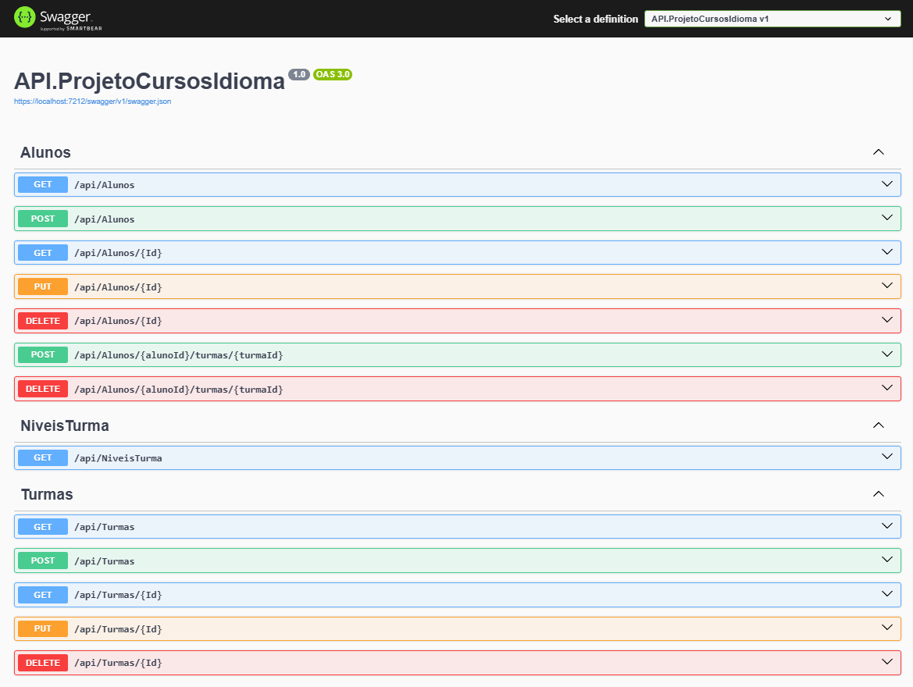
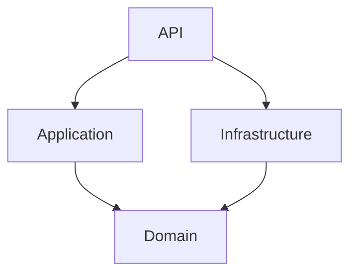

# API de Gerenciamento de Cursos de Idiomas

API REST desenvolvida em ASP.NET Core para gerenciamento de alunos, turmas, níveis de ensino e matrículas em uma empresa de cursos de idiomas.

O projeto foi desenvolvido utilizando uma arquitetura em camadas baseada em DDD, Entity Framework Core com abordagem Code First, SQL Server e documentação por Swagger/OpenAPI.

Obs.:
- README desenvolvido com ajuda de IA para que fique melhor organizado e legível.
- Conteúdos usados para desenvolvimento do projeto: https://www.youtube.com/playlist?list=PL_OVypi7ED9Et7fRYH8YBbybS65sBj2UE, https://learn.microsoft.com/pt-br/aspnet/core/tutorials/first-web-api?view=aspnetcore-8.0&tabs=visual-studio, https://learn.microsoft.com/pt-br/aspnet/core/tutorials/web-api-help-pages-using-swagger?view=aspnetcore-8.0, https://learn.microsoft.com/pt-br/ef/ef6/modeling/code-first/workflows/new-database, https://www.youtube.com/playlist?list=PLWXw8Gu52TRLUoUTZHQ2QaS9uKDr1i2Iw, https://www.youtube.com/watch?v=mwgNdpNN-8o&list=PLWXw8Gu52TRL1_VulHiFimF0tCxlOnW0x&index=3, https://docs.automapper.io/en/latest/, https://github.com/caelum/caelum-stella/wiki, https://learn.microsoft.com/pt-br/ef/core/, junto do uso de inteligência artificial para auxílio.
- Com mais tempo e experiência o uso de inteligência artificial será apenas como assistente de produtividade.

## Documentação da API



## Objetivo

A aplicação permite:

- cadastrar, consultar, atualizar e excluir alunos;
- cadastrar, consultar, atualizar e excluir turmas;
- consultar os níveis disponíveis;
- matricular um aluno em uma ou mais turmas;
- remover a matrícula de um aluno;
- aplicar regras de negócio relacionadas a CPF, e-mail, vagas e exclusões.

## Tecnologias utilizadas

- C#
- .NET 8
- ASP.NET Core Web API
- Entity Framework Core
- SQL Server
- AutoMapper
- Swagger / OpenAPI
- Caelum.Stella.CSharp
- Git e GitHub

## Integração contínua

O repositório possui um workflow do GitHub Actions que restaura
as dependências e compila a solution em modo Release utilizando
.NET 8 em um runner Linux.

O workflow valida automaticamente a compilação em pushes e pull
requests direcionados ao branch master.

## Arquitetura

O projeto foi organizado em quatro camadas:

```text
ProjetoCursosIdioma
├── API.ProjetoCursosIdioma
├── Application.ProjetoCursosIdioma
├── Domain.ProjetoCursosIdioma
└── Infrastructure.ProjetoCursosIdioma
```

### API

Responsável por:

- receber requisições HTTP;
- disponibilizar os Controllers;
- converter os resultados da Application em respostas HTTP;
- configurar injeção de dependência;
- disponibilizar o Swagger.

### Application

Responsável por:

- executar os casos de uso;
- aplicar o fluxo das regras de negócio;
- disponibilizar DTOs;
- disponibilizar Services;
- realizar os mapeamentos com AutoMapper;
- retornar resultados de sucesso ou falha para a API.

### Domain

Responsável por:

- representar as entidades de domínio;
- armazenar comportamentos relacionados às entidades;
- definir as interfaces dos repositórios;
- permanecer independente de banco de dados e ASP.NET Core.

### Infrastructure

Responsável por:

- acesso ao SQL Server;
- implementação dos repositórios;
- configuração do Entity Framework Core;
- DbContext;
- migrations.

## Dependências entre as camadas



A camada Domain não possui dependência das demais camadas.

## Entidades

### Aluno

Possui:

- ID;
- nome;
- CPF;
- e-mail;
- matrículas em turmas.

### Turma

Possui:

- ID;
- nome;
- número da turma;
- ano letivo;
- nível;
- alunos matriculados.

### Nível da turma

Representa os níveis disponíveis para classificação das turmas, como:

- Básico;
- Intermediário;
- Avançado.

### AlunoTurma

Entidade associativa responsável pelo relacionamento muitos-para-muitos entre alunos e turmas.

## Regras de negócio

A aplicação implementa as seguintes regras:

- o aluno deve ser criado com pelo menos uma turma;
- o CPF deve ser válido;
- o CPF é normalizado antes de ser armazenado;
- não é permitido cadastrar CPFs duplicados;
- o e-mail deve possuir formato válido;
- não é permitido cadastrar e-mails duplicados;
- um aluno pode ser matriculado em várias turmas;
- o aluno não pode ser matriculado duas vezes na mesma turma;
- cada turma pode possuir no máximo cinco alunos;
- uma turma duplicada não pode ser cadastrada;
- uma turma deve possuir um nível existente;
- um aluno associado a uma turma não pode ser excluído;
- uma turma com alunos matriculados não pode ser excluída.

Além das validações realizadas pela aplicação, índices e restrições no banco de dados protegem a integridade dos dados.

## Endpoints

### Alunos

| Método | Endpoint | Descrição |
|---|---|---|
| GET | `/api/alunos` | Consulta todos os alunos |
| GET | `/api/alunos/{id}` | Consulta um aluno pelo ID |
| POST | `/api/alunos` | Cadastra um aluno |
| PUT | `/api/alunos/{id}` | Atualiza um aluno |
| DELETE | `/api/alunos/{id}` | Exclui um aluno sem matrículas |
| POST | `/api/alunos/{alunoId}/turmas/{turmaId}` | Matricula um aluno em uma turma |
| DELETE | `/api/alunos/{alunoId}/turmas/{turmaId}` | Remove uma matrícula |

### Turmas

| Método | Endpoint | Descrição |
|---|---|---|
| GET | `/api/turmas` | Consulta todas as turmas |
| GET | `/api/turmas/{id}` | Consulta uma turma pelo ID |
| POST | `/api/turmas` | Cadastra uma turma |
| PUT | `/api/turmas/{id}` | Atualiza uma turma |
| DELETE | `/api/turmas/{id}` | Exclui uma turma sem alunos |

### Níveis

| Método | Endpoint | Descrição |
|---|---|---|
| GET | `/api/niveisturmas` | Consulta os níveis disponíveis |

> Confira se a rota real do seu Controller de níveis é `/api/niveisturmas`. Caso seja diferente, atualize a tabela.

## Exemplos de requisições

### Cadastrar aluno

```http
POST /api/alunos
Content-Type: application/json
```

```json
{
  "cpf": "529.982.247-25",
  "nome": "Maria Silva",
  "email": "maria.silva@email.com",
  "turmaIds": [
    "52bd9b73-9262-4cdb-9be3-08deddc449a2"
  ]
}
```

O CPF pode ser enviado com ou sem formatação. Antes de ser armazenado, ele será normalizado para conter somente os 11 números.

### Cadastrar turma

```http
POST /api/turmas
Content-Type: application/json
```

```json
{
  "name": "Inglês",
  "numeroTurma": "101",
  "anoLetivo": 2026,
  "nivelTurmaId": "20ef9ed7-a2de-4b12-afbc-d7e95a2bdf1e"
}
```

### Matricular aluno em uma nova turma

```http
POST /api/alunos/{alunoId}/turmas/{turmaId}
```

Essa operação verifica:

- existência do aluno;
- existência da turma;
- matrícula duplicada;
- limite máximo de alunos.

## Respostas HTTP

A API utiliza códigos HTTP de acordo com o resultado da operação:

| Código | Significado |
|---:|---|
| 200 | Operação ou consulta realizada com sucesso |
| 201 | Recurso criado com sucesso |
| 204 | Exclusão realizada com sucesso |
| 400 | Dados enviados são inválidos |
| 404 | Recurso não encontrado |
| 409 | Conflito com uma regra de negócio |
| 500 | Erro interno inesperado |

## Pré-requisitos

Para executar o projeto, é necessário possuir:

- .NET SDK 8;
- SQL Server ou SQL Server Express;
- ferramenta Git;
- Visual Studio 2022 ou outra IDE compatível com .NET 8.

Também é possível utilizar o Visual Studio Code com as extensões adequadas para C#.

## Como executar o projeto

### 1. Clonar o repositório

```bash
git clone https://github.com/stt1ck/Projeto_CursosIdioma.git
```

Entre na pasta:

```bash
cd ProjetoCursosIdioma
```

### 2. Restaurar os pacotes

```bash
dotnet restore
```

### 3. Configurar a conexão com o banco

No projeto `API.ProjetoCursosIdioma`, configure a connection string.

Exemplo para autenticação integrada do Windows:

```json
{
  "ConnectionStrings": {
    "PCI_ConnectionString": "Server=localhost;Database=PCI_Db;Trusted_Connection=True;TrustServerCertificate=True;"
  }
}
```

Exemplo usando SQL Server Express:

```json
{
  "ConnectionStrings": {
    "PCI_ConnectionString": "Server=localhost\\SQLEXPRESS;Database=PCI_Db;Trusted_Connection=True;TrustServerCertificate=True;"
  }
}
```

Não coloque usuário, senha ou outras credenciais reais no repositório.

### 4. Criar ou atualizar o banco de dados

Execute:

```bash
dotnet ef database update \
  --project Infrastructure.ProjetoCursosIdioma \
  --startup-project API.ProjetoCursosIdioma
```

No PowerShell, o comando também pode ser executado em uma única linha:

```powershell
dotnet ef database update --project Infrastructure.ProjetoCursosIdioma --startup-project API.ProjetoCursosIdioma
```

As migrations estão armazenadas no projeto Infrastructure.

### 5. Executar a API

```bash
dotnet run --project API.ProjetoCursosIdioma
```

A porta utilizada será exibida no terminal.

A documentação Swagger poderá ser acessada por um endereço semelhante a:

```text
https://localhost:PORTA/swagger
```

## Executando pelo Visual Studio

1. Abra o arquivo `ProjetoCursosIdioma.sln`.
2. Defina `API.ProjetoCursosIdioma` como projeto de inicialização.
3. Configure a connection string.
4. Execute as migrations.
5. Inicie a aplicação.
6. Acesse o Swagger.

## Migrations

Para criar uma nova migration:

```bash
dotnet ef migrations add NomeDaMigration \
  --project Infrastructure.ProjetoCursosIdioma \
  --startup-project API.ProjetoCursosIdioma
```

Para aplicar as migrations:

```bash
dotnet ef database update \
  --project Infrastructure.ProjetoCursosIdioma \
  --startup-project API.ProjetoCursosIdioma
```

## Integridade dos dados

Além das validações da Application, o banco possui proteções como:

- índice único para CPF;
- índice único para e-mail;
- chave composta em `AlunoTurma`;
- restrição para impedir matrículas duplicadas;
- índice composto para impedir turmas duplicadas;
- restrições de relacionamento entre alunos e turmas.

## Decisões técnicas

### Services na camada Application

Os Controllers não acessam diretamente o DbContext ou os repositórios.

Eles chamam Services responsáveis por coordenar os casos de uso e as regras de negócio.

### Resultado padronizado

Os Services utilizam um objeto `Resultado<T>` para retornar:

- sucesso;
- dados;
- mensagem;
- tipo do erro.

A API converte esses resultados em respostas HTTP adequadas.

### Repository Pattern

As interfaces dos repositórios estão no Domain e suas implementações estão na Infrastructure.

Essa estrutura permite separar as regras de negócio da tecnologia de persistência utilizada.

### DTOs

As entidades não são expostas diretamente pelos endpoints.

A API utiliza DTOs para controlar os dados recebidos e devolvidos.

### Normalização de CPF

O CPF é validado e normalizado antes de ser enviado ao banco, evitando diferenças entre valores formatados e não formatados.

## Melhorias futuras

- testes unitários e de integração;
- pipeline de integração contínua com GitHub Actions;
- execução com Docker e Docker Compose;
- tratamento global de exceções com ProblemDetails;
- health checks;
- paginação e filtros nas consultas;
- autenticação e autorização.

## Autor

Desenvolvido por **Guilherme Rodrigues Venturini**.

Projeto criado como desafio técnico e demonstração de conhecimentos em C#, ASP.NET Core, Entity Framework Core, APIs REST e arquitetura baseada em DDD.
